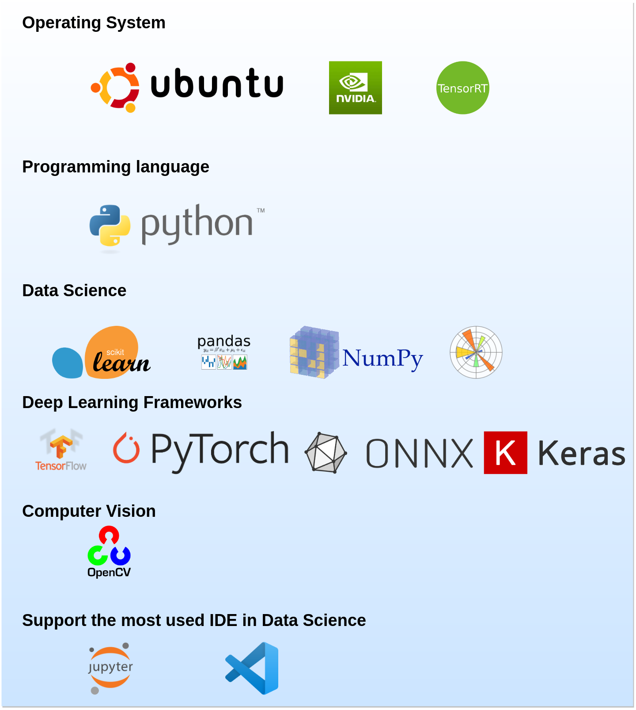

# AI-lab: The ideal development environment for Data Scientists to develop and export machine learning model for production





<!-- TOC -->

- [AI-lab: The ideal development environment for Data Scientists to develop algorithm based on machine learning, artificial intelligence, Computer Vision...](#ai-lab-the-ideal-development-environment-for-data-scientists-to-develop-algorithm-based-on-machine-learning-artificial-intelligence-computer-vision)
	- [Description](#description)
	- [Install AI-lab](#install-ai-lab)
	- [Start developing](#start-developing)
		- [Jupyter notebook](#jupyter-notebook)
		- [VS Code](#vs-code)
	- [Do you have any suggestions ?](#do-you-have-any-suggestions-)

<!-- /TOC -->

## Description
This project is reserved for creating a new development environment using docker for exporting AI models in data science, and specially, computer vision. 

I hand-crafted AI-lab to take advantage of docker capability to have a reproducible and portable development environment. It allows you developing your artificial intelligence based computer vision application in Python using the most used artificial intelligence frameworks.

AI-lab is meant to be used to build, train, validate and test your deep learning models.

	- Ubuntu 18.04
	- NVIDIA CUDA 10.1
	- NVIDIA cuDNN 7.6.0
	- OpenCV 4.1.0
	- Python 3.6
	- Most used AI framework: 
    	- TensorRT
      	- TensorFlow
      	- PyTorch
      	- ONNX
      	- Keras
      	- ONNX-TensorRT
    	- Jupyter-lab
    	- VS Code integration with remote development
    	- numpy
    	- matplotlib 
    	- scikit-learn 
    	- scipy
    	- pandas
    	- and more
	
## Install AI-lab
First, you must have `docker-ce` installed on your machine to be able to use the pre-configured development environment. To do that, simply follow the steps to install [docker for Ubuntu](https://docs.docker.com/install/linux/docker-ce/ubuntu/), or select the suitable version depending on your OS.


* Pull AI-lab from Docker Hub
  
	```bash
		docker pull aminehy/ai-lab
	```

* Run the AI-lab and start your development

	* Move to your application folder
	``` bash
		cd /folder/application
	```

	* then run AI-lab
	``` bash
		xhost +

		docker run -it --rm -v $(pwd):/workspace \
		--runtime=nvidia -w /workspace \
		-v /tmp/.X11-unix:/tmp/.X11-unix \
		-e DISPLAY=$DISPLAY \
		-p 8888:8888 aminehy/ai-lab:latest
	```

## Start developing 
### Jupyter notebook
If AI-lab runs correctly on your machine then `Jupyter notebook` should run automatically. If this is not the case, launch it from the terminal with this command

```bash 
jupyter notebook --allow-root --port=8888 --ip=0.0.0.0 --no-browser
```
### VS Code


[VS Code](https://code.visualstudio.com/) offers the possibily to develop from inside AI-lab through the extension [Remote Development](https://marketplace.visualstudio.com/items?itemName=ms-vscode-remote.vscode-remote-extensionpack).

Read more in details [here](https://code.visualstudio.com/docs/remote/containers).

In practice:
* Create a folder named `.devcontainer` to your application folder
```bash
	cd /path/to/folder/application
	mkdir .devcontainer && cd .devcontaier
```
* Copy all files of this repository to `.devcontainer`

``` bash
	git clone https://gitlab.com/aminehy/ai-lab.git
	mv ai-lab/ /path/to/folder/application/.devcontainer
```

* Once your launch `VS Code` from the application folder containing the `.devcontainer` folder, `VS Code` detect automatically the remote development configuration and will ask you to `Reopen in container` click and your are all setup.


## Do you have any suggestions ?

Please contact me and let me know.
LinkedIn - https://www.linkedin.com/in/aminehy/
